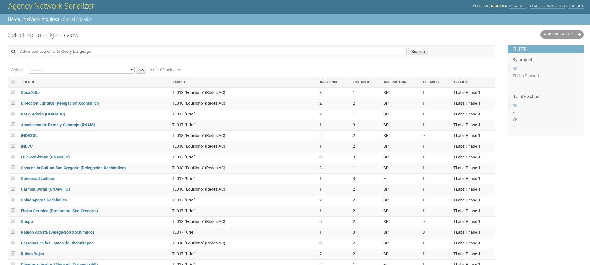
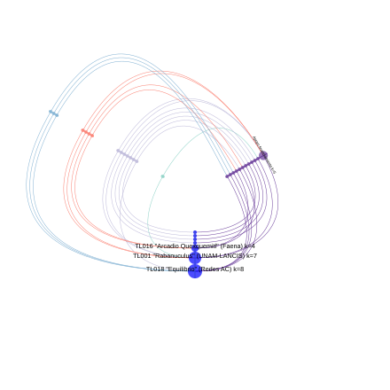

# Agency Network Serializer

This is a web application for the creation and managing of [Agency Networks](https://steps-centre.org/blog/new-forms-agency-help-navigate-xochimilcos-troubled-waters/).

It is a tool for colaboration through which users can capture data
into a database, which can then be queried with arbitrary filters to
construct, visualize and export complex networks.

## Database

AgNeS uses a relational database to store network data. This maintains
consistency across tables and avoids data redundancy.

Complex networks are represented as edgelists. Four are included:

 - Agency edgelist
 - Social edgelist
 - Avatar power edgelist
 - Mental model edgelist

Each is represented by a table that holds the relationship among
entries in other tables.

This is the table scheme:

AgNeS provides web forms to capture and manage data into each of these
tables.

## Exporting and Visualization

By selecting edges from edgelist tables users may export data into
common formats suitable for complex network analyses using other
software:

 - [GraphML](http://graphml.graphdrawing.org/), suitable for [Cytoscape](https://cytoscape.org/)
 - Format suitable for [Pajek](http://vlado.fmf.uni-lj.si/pub/networks/Pajek/)
 - [DOT](https://en.wikipedia.org/wiki/DOT_%28graph_description_language%29), suitable for [GraphViz](https://graphviz.org/)

Special visualizations can also be obtained directly from AgNeS:

 - Hiveplot, for agency networks
 - HeatMap, suitable for comparisons of mental models
 - Force-embeded, both in PDF and interactive formats
