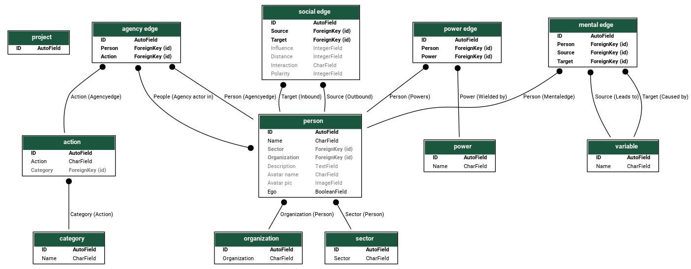

tenorios 222 ed 23 d 6
ex hacienda coapa

# Agency Network Serializer

## Introduction

Agency Network Analylses (ANA) map the social action arena of people by
situating them relative to their collaborators and within their
problem space. This helps actors identify where they have agency in
the system, i.e. over what elements and through what relationships.

This mapping is done via a multi-part interview process during which
data is gathered about actors (their context, worplaces, type of
organization, etc.), their activities (practices, capacities), and
their relationships to other actors.

AgNeS is a database administration interface specially designed to
easily and sistematically gather data for agency network analyses.
Once data is loaded into database, agency networks can be visualized
in several ways, metrics from their structure can be easily computed,
or they can be exported to common standard formats for further
processing with other software.

## Database Architecture

In our ANA database, information is grouped into tables made up of rows
and columns, so that each row holds data for related items. For
example a "People" table has a row for each person with columns such
as "name", and "e-mail".

Links can be created that join different tables together. For example
the "People" table might be related to an "Organization" table, which
may have columns such as "organization name" and "street address".

Constraints can be set on each column, so that only valid data can be
entered. This guarantees data consistency.

The resulting structure can be interrogated with great
flexibility. Using a specialized query language, any combination of
columns may be fetched by complex combinations of criteria.

We have developed a web application which allows users to easily
access these tables.

The following subsections describe the structure of each of the tables
we have designed, as well as the corresponding web forms for
filtering, vizualising, exporting and data input.

Of special interest are the "Edge" tables, which hold relationships
among nodes in the networks that make up the Agency Network Analysis.

### Data about people

 - Sector (academia, ngo, etc.)
 - Organization (government body, ) 
 - collaborators, relationships
 - practices-actions, capacities
	
### Data about the perception-understanding of a system 

 - Biophysical and socio-political variables

## Networks in an ANA
 
### Agency networks
	Visualizations
	 - hiveplot
	
### Social network (person, person)

### Power network (avatar, power)

 
### Cognitive maps (variable, variable)

They are abstractions or internal representations of how a system works.

Examples: 

a) Cognitive Map of an academic

Here a picture of a cognitive map of the perception of
management and state of a natural protected area of the university
(with socio-political & biophysical variables)

b) Agency Network of a Laboratory that studies the Natural Protected Area-NPA (5 egos, each with 3-4 alters)

Show a picture of how they look after a SSI - what data they show

Egos: 

 1. Dr. Nigel (anthropologist)
 2. MSc. Mischa (Lab Tech)
 3. Dr. Sandra (biologist)
 4. Ms. Mirna, (sustainability student)
 5. Mr. Jared (CEO of an environmental NGO)

Alters:

 EGO1: MSc. Mischa, Mr. Jared, Dr. Repsa (head of the NPA)
 EGO2: Dr. Nigel, Dr. Sandra, Ms. Mirna
 EGO3: Ms. Mirna, Mr. Admin (permits for NPA), Dr. X (ecologist), Mr. Bugs (student)
 EGO4: Ms. Tutsi (user), Dr. Sandra
 EGO5: Dr. Nigel, Dr. Repsa, Mr. Green (International NGO), Mr. Admin, .... ??

